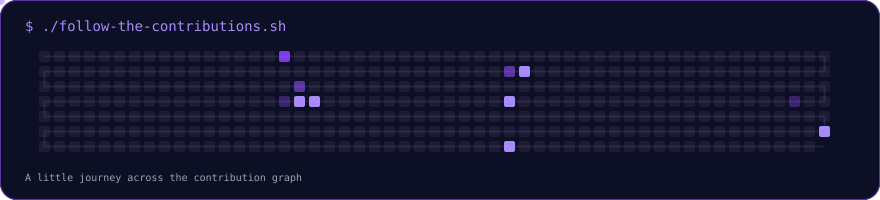

<div align="center">


[](https://github.com/dastanalseit)


[](https://github.com/dastanalseit)
[](https://github.com/dastanalseit?tab=followers)

</div>

---

### About me

I'm Dastan, a developer based in Astana. I work across back-end and front-end development, from APIs and data models to interfaces people can use. My public projects include a movie management app and a collaborative blockchain course project. I'm also exploring machine learning and enjoy learning by building.

**Open to:** collaborating on software projects, learning with other developers, and opportunities to grow in back-end, front-end, and machine learning.

---

### Tech stack

| Area | Tools I've used in my public work |
|:--|:--|
| Languages | Python · JavaScript · HTML · CSS |
| Front-end | Vanilla JavaScript · Fetch API · responsive interfaces |
| Back-end & data | Node.js · Express · REST APIs · MongoDB Atlas |
| Workflow | Git · GitHub · GitHub Actions |

<div align="center">


</div>

---

### AI / ML interests

| Area | Current focus |
|:--|:--|
| Machine learning | Building foundations and applying them in hands-on projects |
| Data work | Using Python to explore, transform, and understand data |
| Product thinking | Connecting technical ideas to useful, approachable experiences |

---

### Featured projects

<details open>
<summary><strong>🎬 Movies Management System — full-stack web app</strong></summary>

<br>

A movie catalog with a responsive single-page interface and a Node.js API. Users can create, edit, delete, filter, and sort movies; the interface updates through the Fetch API.

| | |
|:--|:--|
| Stack | Node.js · Express · MongoDB Atlas · HTML · CSS · JavaScript |
| Engineering | CRUD API, input validation, HTTP error handling, logging, and responsive UI |
| Context | Collaborative back-end course project |
| Repository | [Explore the code](https://github.com/dastanalseit/MyMovie_website) |

</details>

<details>
<summary><strong>⛓️ Blockchain Technologies — collaborative DeFi course project</strong></summary>

<br>

A team-built decentralized protocol combining an automated market maker, lending mechanics, an ERC-4626 vault, governance, oracles, indexing, and a web interface. My documented contributions focused on the AMM, lending, and vault components.

| | |
|:--|:--|
| Stack | Smart contracts · Foundry · React · The Graph · Chainlink |
| Engineering | Contract-level testing and integration across a larger team project |
| Context | Blockchain Technologies 2 final project |
| Repository | [Explore the code](https://github.com/dastanalseit/final_blockchain_technologies) |

</details>

---

### Project experience

| Work | What I practiced |
|:--|:--|
| Full-stack movie app | Designing API routes, connecting a database, and building a usable browser interface |
| Collaborative protocol | Implementing AMM, lending, and vault components within a multi-part team project |

---

### GitHub analytics

<div align="center">


</div>

---

### GitHub trophies

<div align="center">


</div>

---

### Contribution activity

<div align="center">


</div>

---

### Contribution snake

<div align="center">



</div>

---

### Current focus

```yaml
learning: machine learning fundamentals
building: back-end APIs and front-end experiences
exploring: useful products at the intersection of software and data
open_to: collaboration and growth opportunities
```

---

### Connect

<div align="center">

[](https://github.com/dastanalseit)

**Let's build something useful.**


</div>
